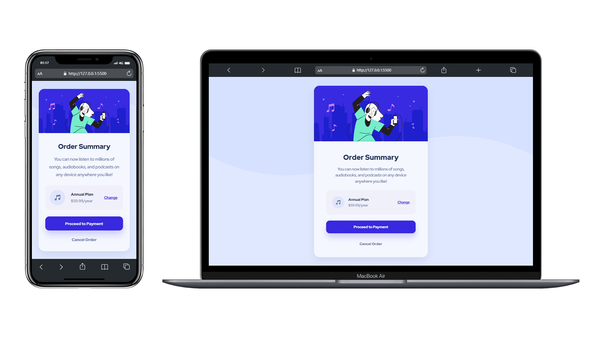

# ✅ Frontend Mentor: Order Summary Card

Hello everyone! 😉

🚶‍♂️ I've successfully completed the [Frontend Mentor's challenge for the order summary card](https://www.frontendmentor.io/challenges/order-summary-component-QlPmajDUj/hub)! Engaging in these challenges proves invaluable for honing coding skills, providing practical experience with real-world projects.

## 🗿 Overview

### 📷 Screenshots

💯 I'm definitely a little bit faster than before, and I'm going to complete more challenges to improve as much as I can.

### 🔗 Links

- CodeSandbox URL: [https://qy8cf2.csb.app](https://qy8cf2.csb.app)
- Live Site URL: [https://yavuzkarakus.github.io/frontendMentorOrderSumCard](https://yavuzkarakus.github.io/frontendMentorOrderSumCard)

## 🚀 My process

### ⚡ Built with

- Use of flex and gap
- Semantic HTML5 markup
- Mobile-friendly full responsive.
- CSS custom properties

### 👾 What I learned

What I learned from this project was that if you get a project like this, you may not be given all the information at the same time. So you have to come up with active and beautiful solutions yourself. In this challenge, some of the material is incomplete, so you have to pay attention and correct it.

### 💪 Continued development

Yes, I know I did the last challenge 2 weeks ago and I want to complete as many more challenges as I can, but I don't have the time. Don't worry, there will be more.

## 🚩 Author

- Frontend Mentor - [@yavuzkarakus](https://www.frontendmentor.io/profile/yavuzkarakus)

## 📒 Notes

🚶‍♂️ I plan to continue these challenges as long as I can. If you are interested in these topics, don't forget to tune in and follow me.

⭐ If you liked this project and the challenge, please don't forget to star it.
